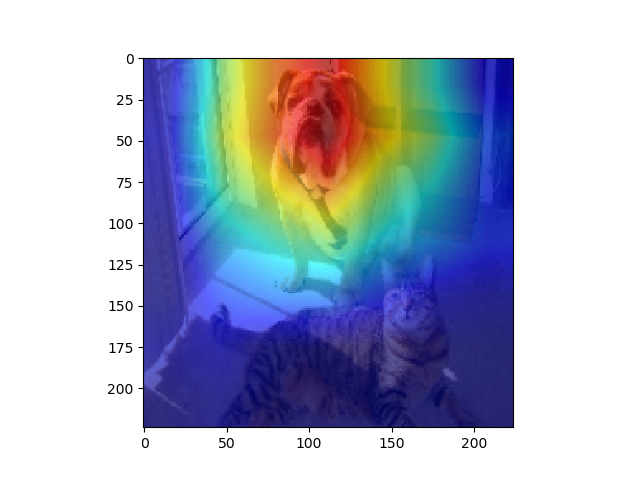
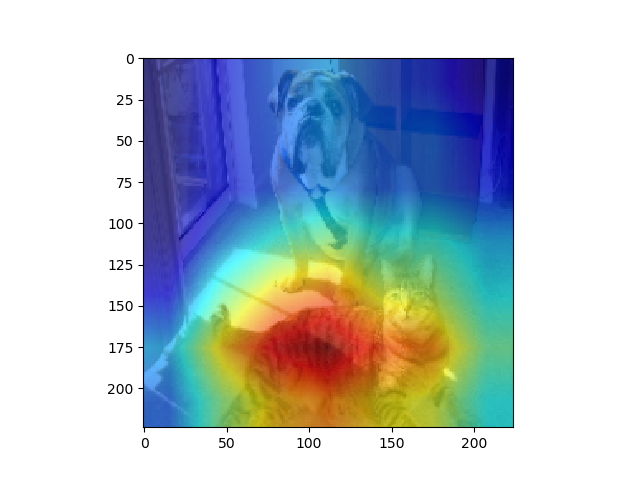
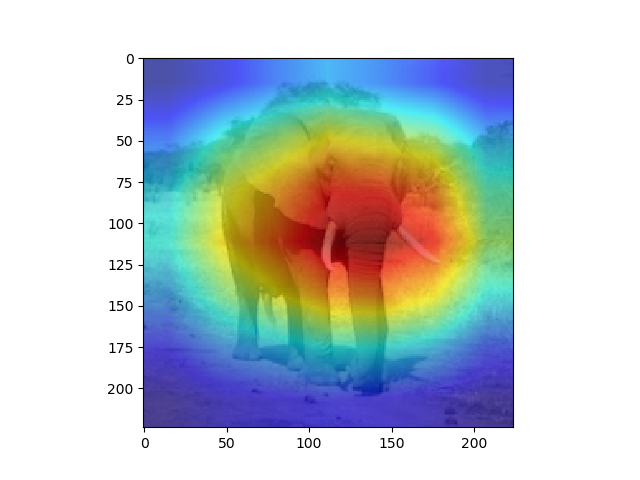

# grad-cam-pytorch-light
A customizable lightweight implementation of Grad-CAM (Gradient-weighted Class Activation Mapping) [arXiv](https://arxiv.org/abs/1610.02391). This implementation works for custom models.

## Usage
```{python}
from grad_cam import grad_cam

grad_cam(<Model>, <Image>, <Layer>, <Label>)
```

`<Model>`: A pytorch model.
`<Image>`: Transformed image for caculating Grad-CAM, a three dimensional tensor.
`<Layer>`: The layer to back-prop to for calculating gradients.
`<Label>`: The label to start back-prop.

## Example

See `example.py` for examples.

## Sample Images

'Boxer' label and 'Tiger Cat' label for the same image:

  

'African elephant, Loxodonta africana' label for an image containing an elephant:

